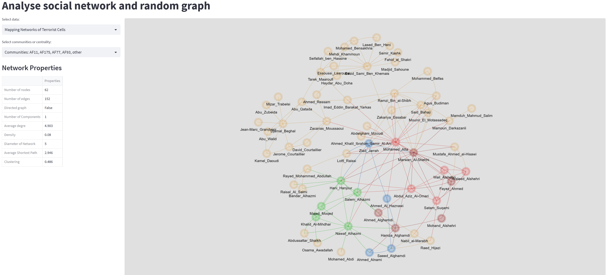
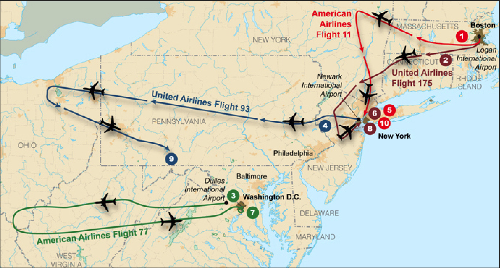

# Terrorist and random network analysis


## Installation

To install the required packages, follow these steps:

- Clone this repository to your local machine.

- Open a terminal window and navigate to the root directory of the repository.

Option 1: Install via pip
 
Create a virtual environment by running the following command:

```bash
    python -m venv venv
```
- Activate the virtual environment. If you use Windows, run:
```bash
    source venv/Scripts/activate
```
If you use Macbook or Linux, run:

```bash
    source venv/bin/activate
```
Install the required packages by running:
```bash
    python -m pip install -r requirements.txt
    streamlit run src/app.py
```

Option 2: Install via Docker

- Build the Docker image by running the following command:
```bash
docker build -t my-streamlit-app .
```
- Run the Docker container by running the following command:
```bash
docker run -p 8501:8501 my-streamlit-app
```

This will start the Docker container and map port 8501 of the container to port 8501 of your local machine.

Finally, open a web browser and go to http://localhost:8501 to access the Streamlit app.

## You can check my app streamlit here
Streamlit app: [Link](https://nmh4598ana.streamlit.app/)




## Introduction
We will discover the formation of terrorist social networks. The "Hamburg cell" was a group of radical Islamists based in Hamburg, Germany on November 1, 1998, which included students from different Arab countries who eventually became key agents in the September 11 attacks. They are the important members: <span style="color:#990000">**Marwan al-Shehhi** </span>, <span style="color:#0066cc">**Ziad Jarrah** </span > and <span style="color:#ff4d4d">**Mohamed Atta**</span>, who led the four hijacking teams, . They arrived in the United States in mid-2000 to conduct flight training. Other members included <span style="color:orange">Said Bahaji, Zakariya Essabar, Mounir el-Motassadeq and Abdelghani Mzoudi</span>. And <span style="color:orange">Ramzi bin al-Shibh</span>, who conspired with the other three members but was unable to obtain a visa to enter the United States. It was later replaced with <span style="color:#33cc33">**Hani Hanjour**</span>. But the first hijackers to arrive in the United States were <span style="color:#33cc33">**Khalid al-Mihdhar**</span> and <span style="color:#33cc33"> **Nawaf al-Hazmi** </span> in January 2000.



<p style="text-align: center;"> Flight paths of the four planes<p>

## Analyze

This project aims to analyze terrorist networks and compare them to random networks using graph visualization techniques. The project will use various centrality measures and community detection algorithms to understand the structure and characteristics of these networks. The ultimate goal is to use the theory of random graphs to reconstruct the terrorist network and identify the closest random network.

 - Descriptive statistics of graph

|   Number of nodes |   Number of edges | Directed graph   |   Number of Components |   Average degre |   Density |   Diameter of Network |   Average Shortest Path |   Clustering |
|------------------:|------------------:|:-----------------|-----------------------:|----------------:|----------:|----------------------:|------------------------:|-------------:|
|                62 |               152 | False            |                      1 |           4.903 |      0.08 |                     5 |                   2.946 |        0.486 |

Centrality measures such as degree centrality, betweenness centrality, and eigenvector centrality will be used to identify key individuals and groups within the network. Community detection algorithms will be applied to identify subgroups within the network.

Once the characteristics of the terrorist network have been established, the project will use the theory of random graphs to reconstruct the network and identify the closest random network. This will allow us to understand how the structure of the terrorist network compares to a randomly generated network and identify any patterns or anomalies.

The project will involve programming in Python using networkx and other libraries like pyvis and streamlit. The project will be useful for understanding the structure and dynamics of terrorist networks, which can aid in the development of counter-terrorism strategies. 

## References

Uncloaking Terrorist Networks by Valdis E.Krebs: 
https://journals.uic.edu/ojs/index.php/fm/article/view/941/863

"Mapping networks of terrorist cells.\" Connections 24, 43-52 (2002):
http://insna.org/PDF/Connections/v24/2001_I-3-7.pdf 

Network catlogue, repository and centrifuge data Netzschleuder: https://networks.skewed.de/net/terrorists_911

## Useful links: 

Network Analysis & Visualisation: Game of Thrones Character Network [Link](https://medium.com/analytics-vidhya/network-analysis-visualization-game-of-thrones-character-network-dc96ea3013e9)

Deploying Pyvis on Streamlit (detailed tutorial): [Link](https://towardsdatascience.com/how-to-deploy-interactive-pyvis-network-graphs-on-streamlit-6c401d4c99db)

[1] A.L. Barabási, [Network Science Book (2015),](http://networksciencebook.com/)  Cambridge University Press

September 11 attacks:
https://en.wikipedia.org/wiki/September_11_attacks
